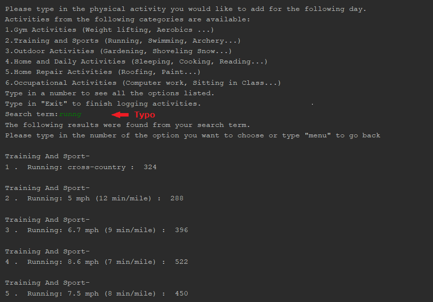
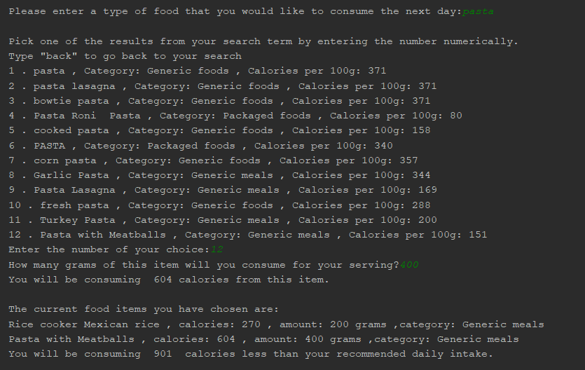
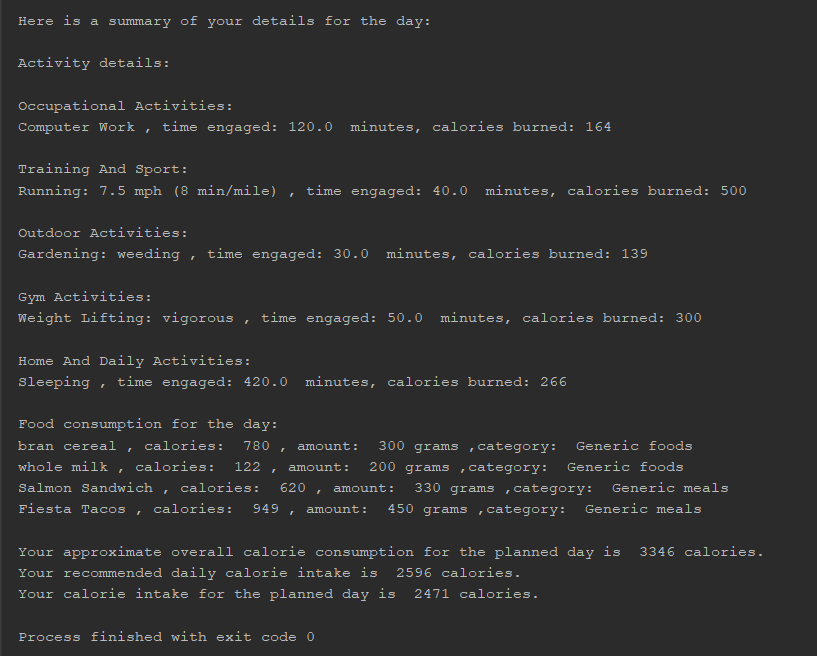

# Daily Diet Planning Project
## Goal
This project was designed with the intention of helping users to plan out their daily personal diet and activity levels, 
while also providing personalized metrics to aid in weight gain/weight loss goals.
## Features and Implementation
### Personlized metrics
The program will provide you with personalized information regarding your health status, BMI, Basal Metabolic Rate 
and calorific details regarding your daily activities and food consumption. The health evaluations and recomendations are performed based on
guidelines provided by the NHS (National Health Service of England).
### Search for and log in time durations for your daily activities
A large variety of physical activities from menial tasks (sitting, sleeping etc.) to more strenuous tasks (running, tennis etc.) have been included
in this program. The calorific consumption of each task, which is dependant on your body weight was also sourced through [a study conducted by 
Havard University](https://www.health.harvard.edu/diet-and-weight-loss/calories-burned-in-30-minutes-of-leisure-and-routine-activities).
The search feature was implemented through the use of a customized [trie structure](https://medium.com/basecs/trying-to-understand-tries-3ec6bede0014).
In simple terms, a trie is a data tree with a single character at each node, with the max number of children for each node being set to 26 (the full alphabet).
Words are stored along branches of this tree. This structure allows for **faster lookup, minimal memory usage and typo handling**.

### Search for food items and their calorific details
The user can search for food items and their calorific information. The search term will be used to query [the Edamam food database API](https://developer.edamam.com/food-database-api-docs) and the results of this search and details regarding calories per 100g and food category
will be presented to the user. The user can submit how much of the item they will be consuming. After each submission, the user is presented with a summary
of their diet for the day as well as the calorific difference between their recommended intake.

### Error Handling
The program will notice any errors in user input (unless it is a search input) and present information regarding how it can be rectified.

## Final Result

# Running The Program
Simply download all the files and run main.py 
